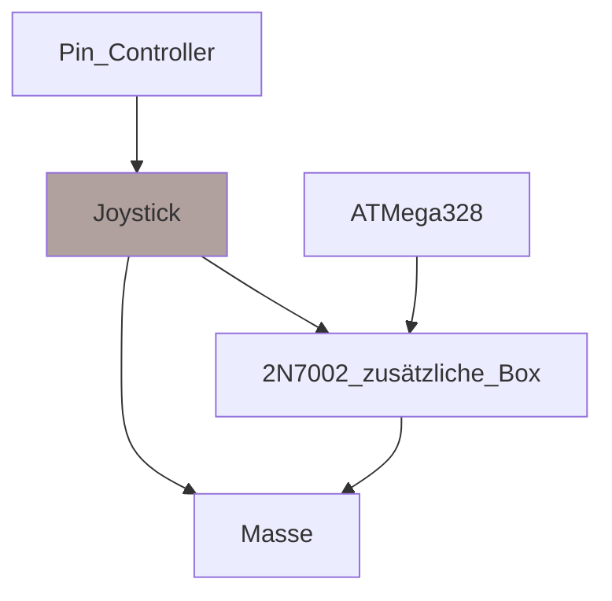

# Samro_Bedienbox

## Übersicht:
Dieses Repository beinhaltet PCB-Daten (Gerber-Dateien und ein KiCAD-Projekt) sowie den Quellcode für die Programmierung des verwendeten ATMega328.

## Hintergrund:
Dies ist eine Steuerungsbox, die die bestehende Steuerung eines Samro Offsett KK Kartoffelvollernters ergänzt. Die Standardbedienung der 20 Jahre alten Maschine weicht von modernern Bedienungslayout ab. Um mir als Fahrer, der bei einem Lohnunternehmer im Herbst etliche Stunden mit neuen Maschinen fährt, jeweils den Wechsel der Maschine zu erleichtern, wurde diese Bedienung konstruiert. Die Funktionsbelegung ähnelt der Grimme GBX 800, wie sie beim Lohnunternehmen Wyss-Wyss verwendet wird.

## Funktion:
### Übersicht
Die Kontaktschalter der Samro-Bedienbox ziehen das Signal auf Masse. Die Hardware der Box erkennt dies und sendet ein entprechendes Signal an die Hauptplatine der Maschine. Die zusätzliche Bedienbox ergänzt diese FUnktionsweise. An die Signalpins der Kontaktschalter werden Kabel gelötet welche mit der zusätzlichen Box verbunden werden. 
### Detailiert
Beispielhafte Darstellung der Funktionsweise an einer Funktion (Deichsel rechts):

Um die Verwendung von ISP auf der Platine zun ermöglichen dürfen ISP-Pins des ATMega328 nicht belegt werden. Dies hat zur Folge, dass nicht alle wichtigen Funktionen der Maschine auf einer zusätzlichen Box belegt werden können. Abhilfe wird mit Jumpern geschaffen. Von zwei ATMega328 Ausgangspins (PD1 und PD2) kann ausgewählt werden, ob das Signal den Bunker oder die Dammaufnahme ansteuern soll. Andere Belegungsänderungen sind während Laufzeit nicht möglich und müssen durch ändern des Quellcodes und Neukompilierung gemacht werden.

## Software:
Es gibt kein seperater Ordner der für den Quellcode benutzt wird. Die .ino-Datei beinhaltet alle Daten. 

## Hardware:
Im Hardware-Ordner finden sich die Schemas, Gerber-Dateien und das dazugehörige KiCAD-Projekt. 

## Programmierung des ATMega328:
### Es gibt viele verschiedene, sehr gute Artikel dazu. Ein Beispiel: https://www.brennantymrak.com/articles/programming-avr-with-arduino

|ATMEga328|Arduino|
|----------|-------|
|PC6|Pin 10|
|PB5|Pin 13|
|PB4|Pin 12|
|PB3|Pin 11|
+ In IDE (Arduino IDE oder Visual Micro in VS2022), wähle Arduino als ISP
+ Richtiger Chip mit korrekter Clock-Speed
